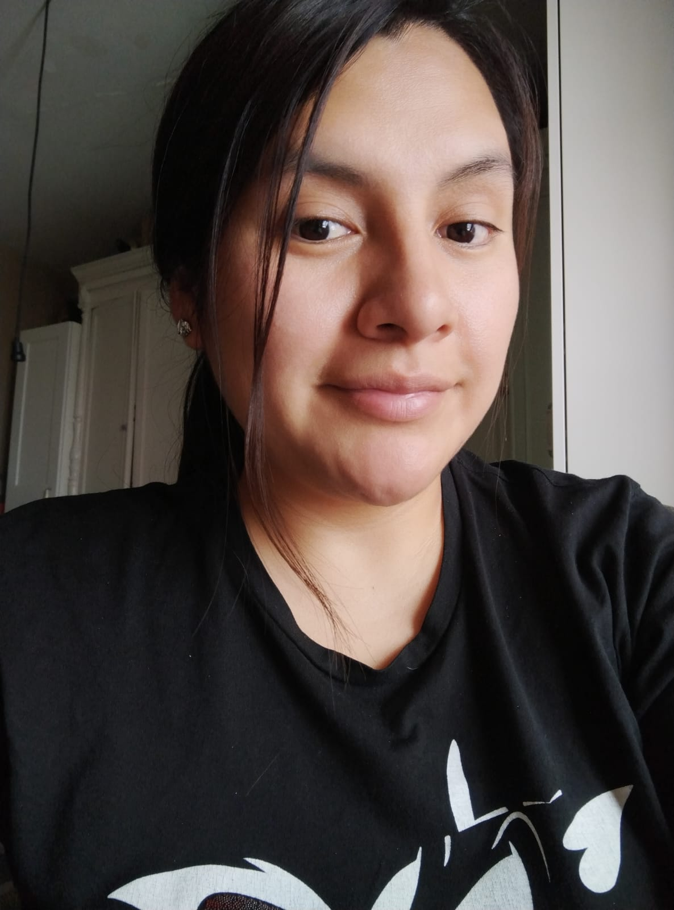
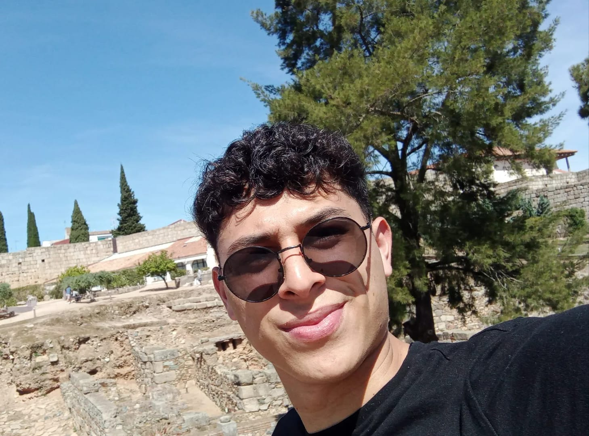

<<<<<<< HEAD
<<<<<<< HEAD
# reservasjs
=======
=======
>>>>>>> anthony
<h1 align= center> :tique: FANTASTIC WORLD :tique: </h1>

  

<h2 align=center> <em> :tique: :tique: :tique: :tique: :tique: Reservas :tique: :tique: :tique: :tique: :tique: </em> </h2>
<h3>Descripción:</h3
Hemos creado esta página en la que el cliente hará su reservación en nuestro parque de diversiones <strong> Fantastic World. </strong> Para cualquiera de nuestros juegos podrá ingresar sus datos, cuantas personas adultas, y cuantas menores de edad, para qué día y por supuesto, la fecha, hemos intentado hacer nuestra plataforma de la mejor manera para que sea entendible para ti! :sonrojo: :manos_levantadas:
<h1 align= center> :dardo:  :carrera_de_caballos: :invasor_del_espacio: :corona: :tréboles: :videojuego: :dado: :guitarra: :gafas: :piruleta: :cervezas: :hamburguesa: :helado:  :chocolatina:  :rosquilla:  :pastel:  :caramelo: :noria: :cohete: :bicicleta: :estrellas: :caballito_de_carrusel: :fuente: :bote_de_remos:  :luz_giratoria: :artes_escénicas: :carpa_de_circo: :banderas_cruzadas: :mastil_con_bandera_triangular: :bandera_de_cuadros: :tachuela_redonda: </h1>

 
   

   <h4 align="center">
:construcción: Proyecto en construcción :construcción:
</h4>

 
 

<ul>
  <li>Visual Studio Code.</li>
  <li>GitHub</li>
  <li>JavaScript</li>
  <li>Trello.</li>
  <li>Figma</li>
  <li>Drawio.com</li>
  <li>Canvas</li>
</ul>

 
 
 

## Instalación
<ol>
  <li>Abre tu navegador web y ve a la GitHub en https://github.com.</li>
  <li>Haz clic en el botón "Sign up" si aún no tienes una cuenta de GitHub.Si ya tienes cuenta  clic en "Sign in".</li>
  <li>Completa el proceso de registro o inicio de sesión .</li>
  <li>Crear un nuevo repositorio haciendo clic en el botón "New" en la página principal de GitHub.</li>
  <li>Si deseas descargar un repositorio existente, puedes buscar el repositorio en la barra de búsqueda en la parte superior de la página.</li>
  <li>Proporciona un nombre al repositorio nuevo y una descripción opcional. Puedes elegir si el repositorio será público o privado.</li>
  <li>Haz clic en el botón "Create repository" para crear el repositorio.</li>
  <li>En la página del repositorio, verás la URL del repositorio.</li>
  <li>Copia el URL haciendo clic en el botón "Code" y seleccionando la opción "Copy" o copiando directamente la URL en la barra de direcciones del navegador.</li>
  <li>Abre una terminal o línea de comandos en tu computadora y navega hasta el directorio donde deseas descargar el repositorio.</li>
  <li>En la terminal, utiliza el comando git clone seguido de la URL del repositorio para descargar el repositorio. </li>
  <li>El repositorio se descargará en tu directorio actual y estarás listo para trabajar con él localmente.</li>
  <li>Abre tu navegador web y ve al sitio web oficial de Visual Studio Code en https://code.visualstudio.com/.</li>
  <li>Haz clic en el botón de descarga para iniciar la descarga del archivo de instalación de Visual Studio Code.</li>
  <li>Una vez que se haya completado la descarga, ejecuta el archivo de instalación.</li>
 <li>Al ejecutar el comando, Visual Studio Code se abrirá y mostrará el contenido del directorio en su interfaz. Ahora puedes editar, navegar y trabajar con los archivos y carpetas en Visual Studio Code.</li>
</ol>
## Diagrama de Flujo: Proyecto Reserva

## Autores
<ol>
<ul><strong>Rebeca Poma:martillo::tecnólogo::ordenador:.</strong></ul>

<ul><strong>Anthony Brayan:martillo::ordenador::tecnólogo:.</strong></ul>

<ul><strong>Javier Serrano:tecnólogo::martillo::ordenador:.</strong></ul>

<<<<<<< HEAD
</ol>
>>>>>>> anthony
=======
</ol>
>>>>>>> anthony
